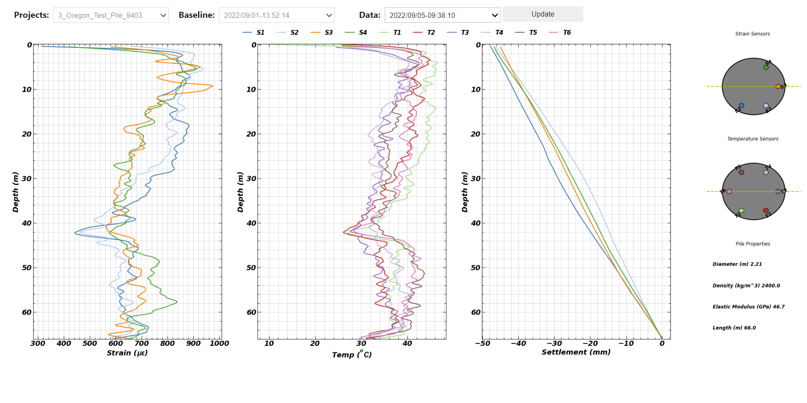

[Pile DSS Analyzer](https://pile-dss-analyzer.herokuapp.com/)
=========

### Description

[Pile DSS Analyzer](https://pile-dss-analyzer.herokuapp.com/) is a jupyter notebook web application (deployed on Heroku) developed to visualize real-time remote strain and temperature data of instrumented piles with ditributed fiber optic sensors. The app updates to the latest data automatically every 5 minutes automatically. Alternatively, user can also visualize at specific time intervals by using the dropdown list as described below. The instrumentaion on the projects shown in this app are performed by the [Soga Research Group](https://geomechanics.berkeley.edu/) at the University of California Berkeley.

### Manual 

Below are the list of user interface and what they offer

1) Projects : Select a project from projects list
2) Baseline : Relect the time with respect to which data is processed 
3) Data : Select the time of data to be enquired
4) Update : Update the plots to the latest live data 

---
Created by: [Sumeet Kumar Sinha](http://www.sumeetksinha.com)

Request for adding features on sumeet.kumar507@gmail.com
